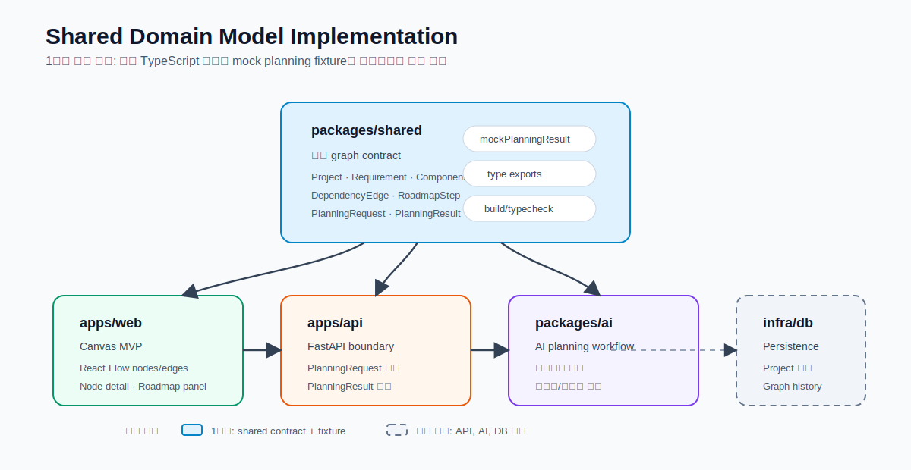

# Shared Domain Model Implementation Report

## 개요

이 보고서는 `dev_plan.md`의 1단계인 **공통 도메인 모델 정의** 작업 결과를 정리한다.

이번 작업의 목적은 Web, API, AI layer가 같은 planning graph contract를 공유할 수 있도록 `packages/shared`에 최소 TypeScript 패키지를 만들고, 이후 Canvas MVP에서 바로 사용할 수 있는 mock planning fixture를 준비하는 것이다.

## 아키텍처 요약



## 작업 범위

### 구현한 항목

- `packages/shared`를 독립적으로 import 가능한 TypeScript 패키지로 구성했다.
- Project, Requirement, ComponentNode, DependencyEdge, RoadmapStep 중심의 공통 타입을 정의했다.
- PlanningRequest와 PlanningResult 계약을 정의했다.
- React Flow에서 바로 사용할 수 있도록 `ComponentNode.position`을 `{ x: number; y: number }` 형태로 고정했다.
- Web Canvas MVP에서 사용할 수 있는 `mockPlanningResult` fixture를 추가했다.
- Node.js LTS와 npm 환경을 설치하고 shared package build/typecheck를 검증했다.

### 제외한 항목

- Zod 기반 런타임 검증은 아직 추가하지 않았다.
- FastAPI Pydantic 모델은 아직 추가하지 않았다.
- DB schema와 migration은 아직 추가하지 않았다.
- 실제 React Flow 화면 렌더링은 2단계 Frontend Canvas MVP에서 진행한다.

## 생성 및 변경 파일

### 패키지 설정

- `packages/shared/package.json`
  - 패키지명: `@ai-planning-platform/shared`
  - ESM package로 설정
  - `build`, `typecheck` script 추가
  - TypeScript devDependency 추가

- `packages/shared/tsconfig.json`
  - strict TypeScript 설정 적용
  - declaration file 생성 설정
  - `src`를 입력으로, `dist`를 출력으로 사용

- `packages/shared/package-lock.json`
  - `npm install` 실행으로 생성됨

### 소스 코드

- `packages/shared/src/types.ts`
  - 공통 domain type과 union type 정의
  - `isPlanningResultGraphConsistent` helper 추가

- `packages/shared/src/fixtures/mockPlanningResult.ts`
  - Canvas MVP에서 바로 쓸 수 있는 sample planning result 추가
  - node, edge, roadmap이 서로 연결된 예시 제공

- `packages/shared/src/index.ts`
  - 외부 계층이 import할 public export entrypoint 구성

### 빌드 산출물

`npm run build` 실행 결과 `packages/shared/dist` 아래에 JavaScript와 declaration file이 생성됐다.

대표 산출물은 다음과 같다.

- `packages/shared/dist/index.js`
- `packages/shared/dist/index.d.ts`
- `packages/shared/dist/types.js`
- `packages/shared/dist/types.d.ts`
- `packages/shared/dist/fixtures/mockPlanningResult.js`
- `packages/shared/dist/fixtures/mockPlanningResult.d.ts`

## 정의한 핵심 타입

### 주요 엔티티

- `Project`
  - 프로젝트의 id, title, description, status, timestamps를 표현한다.

- `Requirement`
  - 사용자의 요구사항 원문, projectId, source, priority, timestamps를 표현한다.

- `ComponentNode`
  - planning graph의 node를 표현한다.
  - type, label, description, category, priority, position, metadata를 포함한다.

- `DependencyEdge`
  - node 간 dependency를 표현한다.
  - source와 target은 `ComponentNode.id`를 참조한다.

- `RoadmapStep`
  - 실행 단계와 우선순위, 예상 effort, 선행 step, 연결된 component node를 표현한다.

- `PlanningRequest`
  - API와 AI layer가 받을 planning input 계약이다.

- `PlanningResult`
  - Web, API, AI layer가 공유할 최종 planning output 계약이다.

## 고정한 union 타입

```ts
type ProjectStatus = "draft" | "generated" | "archived";
type RequirementSource = "user" | "imported" | "ai_refined";
type ComponentNodeType =
  | "feature"
  | "system"
  | "api"
  | "data"
  | "ai"
  | "infra"
  | "ui"
  | "workflow";
type DependencyType = "requires" | "feeds" | "blocks" | "related";
type Priority = "low" | "medium" | "high";
type EffortSize = "small" | "medium" | "large";
```

## Mock Planning Result 구성

`mockPlanningResult`는 다음 화면 요소를 검증할 수 있도록 구성했다.

- 요구사항 입력 결과
- React Flow graph canvas
- node detail panel
- roadmap panel

포함된 주요 node는 다음과 같다.

- Requirement Input
- Planning API
- AI Planning Workflow
- Graph Canvas
- Roadmap View
- Project Storage

edge는 모두 fixture 안에 존재하는 node id만 참조하도록 구성했다.

## 검증 결과

### Node 환경

- Node.js LTS 설치 완료
  - 확인 버전: `v24.16.0`
- npm 확인 완료
  - 확인 버전: `11.13.0`
- 시스템 PATH에 `C:\Program Files\nodejs\` 등록 확인 완료

현재 Codex 세션은 설치 전 PATH를 유지하고 있어 명령 실행 시 Node 경로를 임시로 추가했다. 새 PowerShell 또는 IDE 터미널에서는 `node`와 `npm`이 바로 인식될 가능성이 높다.

### 패키지 검증

`packages/shared`에서 다음 명령을 실행했다.

```powershell
npm install
npm run build
npm run typecheck
```

결과:

- `npm install` 성공
- 취약점 0개
- `npm run build` 성공
- `npm run typecheck` 성공

## 현재 상태 요약

현재 프로젝트는 1단계의 핵심 목표였던 **공통 graph contract 기준점**을 확보했다.

이제 다음 단계인 Frontend Canvas MVP에서는 `mockPlanningResult`를 가져와 React Flow canvas에 렌더링하면 된다. 즉, 지금 작업은 아직 화면으로 보이는 기능은 아니지만, 화면에 그릴 데이터 구조와 샘플 그래프를 준비한 상태다.

## 다음 단계 제안

1. `apps/web`에서 Next.js 실행 환경을 확인한다.
2. `@ai-planning-platform/shared`를 web app에서 import할 수 있도록 workspace 또는 path alias를 설정한다.
3. `mockPlanningResult.nodes`와 `mockPlanningResult.edges`를 React Flow node/edge 형식으로 변환한다.
4. 요구사항 입력 영역, graph canvas, node detail panel, roadmap panel을 한 화면에 배치한다.
5. mock fixture 기반으로 2단계 Canvas MVP를 시각적으로 검증한다.
